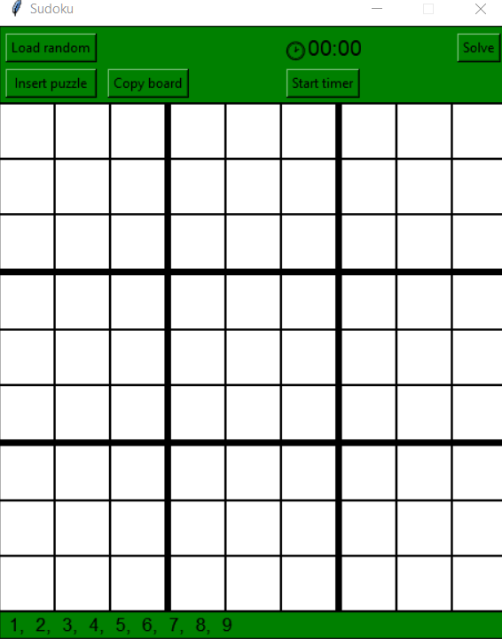

# Sudoku-in-Python
#### Implemented in Python with 1 file compiled to Cython for some speed ups  

  

  

## GUI
### - Top frame
- button for generating a random puzzle - long time for higher difficulties
- list of difficulties to choose
- buttons for copying and inserting puzzle to/from a string
- button for solving the puzzle
- timer
- button for restarting the timer (for inserting digits 1 by 1)
### Board
- 9x9 board with small and large digits to use
### Bottom frame
- list of still avaible digits
  

## Gameplay
- clicking on a digit highlights the same digit everywhere
- use buttons 'F1'-'F9' to insert a small digit 
- use buttons '1'-'9' to insert a big digit
- 'BackSpace' removes last digit in cell
- can use 'Return' / 'Enter' to change small digit into big if only 1 is present
  

## Solver
- can use sudoku algorithm to solve some of the puzzle - uses
- finally uses dfs brute force algorithm
- compiled to Cython to speed it up 
  

## Generator 
- generates a random board that fulfills the sudoku rules
- does random row / column switching
- starts removing random digits and after the set number of clues is met, checks if the board has 1 solution

### Files:
- constants.py - preinitialization of lists, e.g. all cords and digits to speed up some functions
- generator.py - generating a random puzzle
- gui.py - GUI
- solver.py - solving a puzzle
- setup.py - compiling a Cython module of solver.py

## TO-DO maybe:
- generation / solving speed improvements - better algorithms, deeper cython? 
- better gui